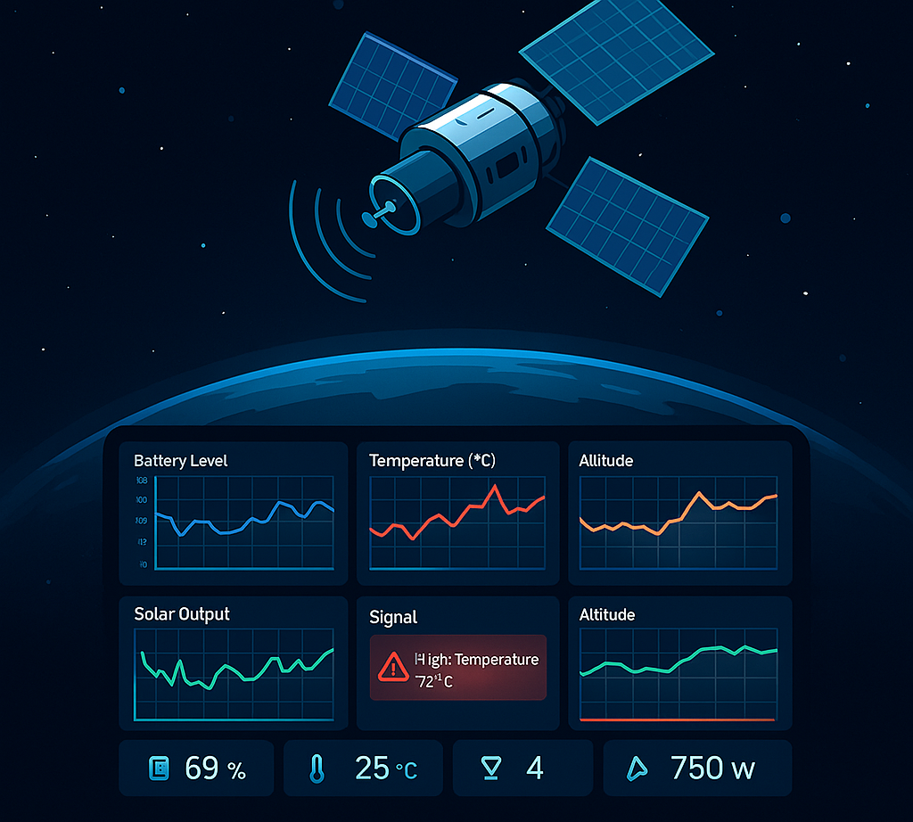
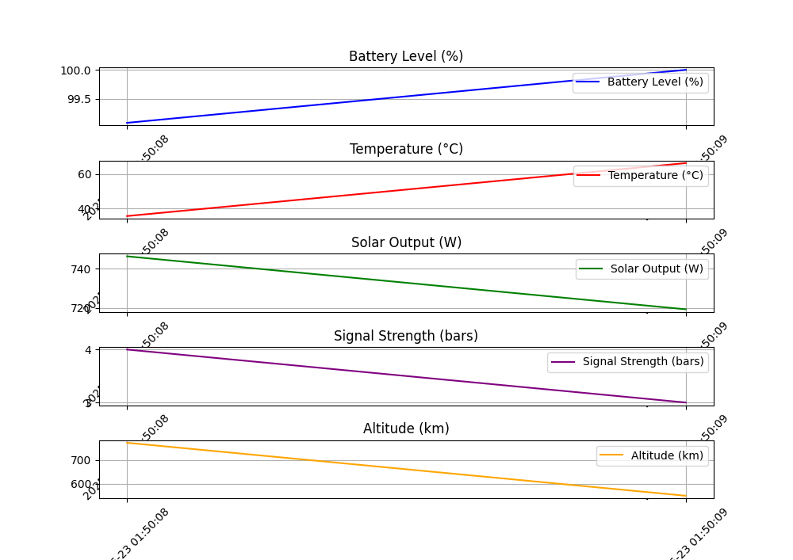
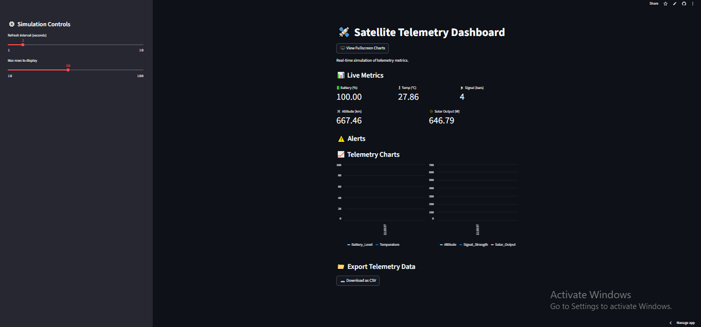

# 🛰️ Satellite Telemetry Simulator


A real-time telemetry dashboard simulating satellite metrics using Python and Streamlit.

## 🚀 Features

- Live telemetry simulation (Battery, Temperature, Altitude, Signal, Solar Output)
- Real-time charts and metric cards
- Alerts for critical readings (Battery < 20%, Temp > 70°C)
- Fullscreen chart view toggle
- Export data as CSV
- Deployed on Streamlit Cloud

## 📸 Screenshot
 

## 🌐 Live Demo

[Click here to open the Satellite Telemetry Simulator](https://satellite-telemetry-simulator-3kvyfpmnekgx2pkqgmr3kh.streamlit.app/)


## 💻 Run Locally

```bash
git clone https://github.com/your-username/satellite-telemetry-simulator.git
cd satellite-telemetry-simulator
pip install -r requirements.txt
streamlit run telemetry_dashboard.py
